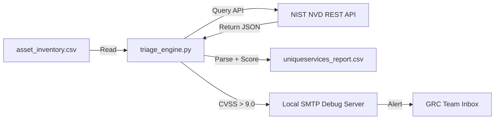

# AutoSec-GRC — Automated Compliance & API Triage Engine

[](https://www.python.org/)
[](LICENSE)
[](https://nvd.nist.gov/)

A small security-automation pipeline that takes a company's asset inventory, checks every asset against the **live NIST National Vulnerability Database (NVD)**, and automatically routes a CRITICAL-severity alert to the GRC (Governance, Risk & Compliance) team — without a human ever opening a CVE feed by hand.

> Built as a hands-on project to learn the core building blocks of security automation: API integration, structured data parsing, and automated incident routing — the same primitives behind tools like Dependency-Track, OWASP Dependency-Check, and enterprise vulnerability scanners.

---

## Why this project exists

Manually cross-referencing a software inventory against the NVD is slow and error-prone, and it doesn't scale past a handful of hosts. This project simulates the first link in a real GRC pipeline: a scheduled job that treats the asset inventory as a source of truth, queries an authoritative external feed, and turns a match into an actionable, routed alert — the same pattern used by CI/CD vulnerability gates and SOC triage tooling.

## Architecture



## Key features

- **Live threat intelligence** — queries the [NIST NVD REST API v2.0](https://nvd.nist.gov/developers) for real, current CVE data via `nvdlib`, not a static/offline feed.
- **CPE normalization** — pads partial CPE strings (the format most real asset inventories actually store) out to the full 13-field CPE 2.3 URI the NVD API requires, avoiding silent false-negative matches.
- **Resilient error handling** — timeouts, connection errors, HTTP errors, and malformed API responses are all caught per-asset so one bad query never kills the run.
- **Automated incident routing** — CVSS v3.1 scores above a configurable threshold trigger an SMTP alert automatically, simulating real-world auto-paging/auto-ticketing behavior.
- **Audit-ready output** — every finding (alerted or not) is written to a structured CSV report with a clear `alert_triggered` column.
- **Secrets hygiene** — API keys and SMTP identities are loaded from a gitignored `config.env`, never hardcoded.

## Tech stack

| Layer              | Tool                                                            |
|---------------------|------------------------------------------------------------------|
| Language             | Python 3.10+                                                    |
| Vulnerability data   | [NIST NVD API v2.0](https://nvd.nist.gov/developers) via `nvdlib` |
| Alerting             | `smtplib` + `email.mime.text` against a local `aiosmtpd` debug server |
| Config management    | `python-dotenv`                                                 |
| Data format           | CSV (`csv` standard library)                                    |

## Project structure

```
AutoSec-GRC/
├── README.md
├── requirements.txt
├── config.env.example       # template — copy to config.env locally
├── .gitignore
├── asset_inventory.csv      # simulated company asset database
├── uniqueservices_report.csv  # generated output (created on first run)
└── scripts/
    ├── sanity_check.py      # pre-flight environment/data check
    └── triage_engine.py     # main automation engine
```

## Getting started

```bash
# 1. Clone and enter the project
git clone https://github.com/<your-username>/AutoSec-GRC.git
cd AutoSec-GRC

# 2. Create and activate a virtual environment
python3 -m venv venv
source venv/bin/activate        # Windows: venv\Scripts\activate

# 3. Install dependencies
pip install -r requirements.txt

# 4. Configure your environment
cp config.env.example config.env
# edit config.env — an NVD_API_KEY is optional but recommended

# 5. Sanity-check your setup
python scripts/sanity_check.py

# 6. In a SECOND terminal, start the local SMTP debug server
python -m aiosmtpd -n -l localhost:1025

# 7. Run the engine
python scripts/triage_engine.py
```

## Sample output

```
[*] Loaded 2 asset(s) from asset_inventory.csv
[*] No NVD_API_KEY set — querying at the public rate limit (~6s/asset).

[*] Scanning org-web-01  (cpe:2.3:a:fortinet:fortios:6.0.4)
    [+] Alert dispatched for CVE-2018-13379 on org-web-01

[*] Scanning org-db-01  (cpe:2.3:a:microsoft:exchange_server:2019)
    No CRITICAL CVEs returned for this asset.

[+] Triage complete. 1 finding(s) written to uniqueservices_report.csv
```

## What I learned

- How the NVD REST API structures CVSS scoring data (v3.1 vs v3.0 vs v2 fallback) and why blindly trusting a wrapper library's example code without reading its actual response schema produces silent bugs (in this project: a list of descriptions mistaken for a single object).
- Why CPE strings need to be fully qualified for an API match, and what happens (silent zero results) when they aren't.
- How to design error handling that degrades per-record instead of crashing a whole batch job — a non-negotiable property for any pipeline that's meant to run unattended.
- Why local SMTP debug servers (`aiosmtpd`) are the correct way to develop and test alerting logic before pointing it at a real mail relay.

## Possible extensions

- Swap the CSV "source of truth" for a real CMDB or cloud asset inventory API.
- Add a `--severity` CLI flag to widen/narrow the CVSS filter.
- Persist findings to a database and diff against the previous run to alert only on *new* CVEs.
- Replace the local SMTP debug server with a real provider (e.g. SES, SendGrid) behind the same `send_alert()` interface.

## Disclaimer

This product uses data from the NVD API but is not endorsed or certified by the NVD. All host names, departments, and email addresses in this repository are fictional/mock data for demonstration purposes only.

## License

MIT — see [LICENSE](LICENSE) for details.
